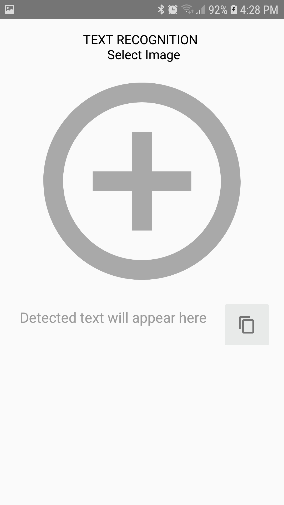
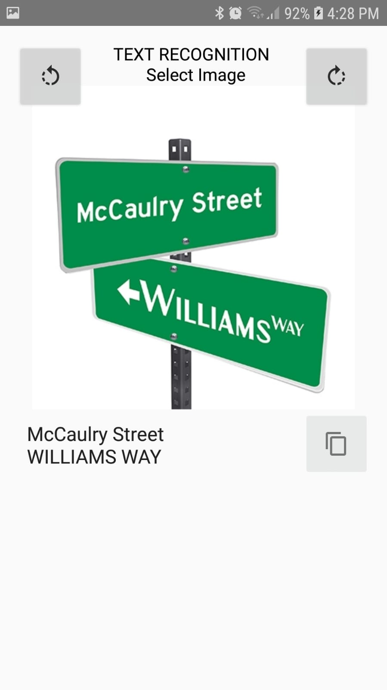
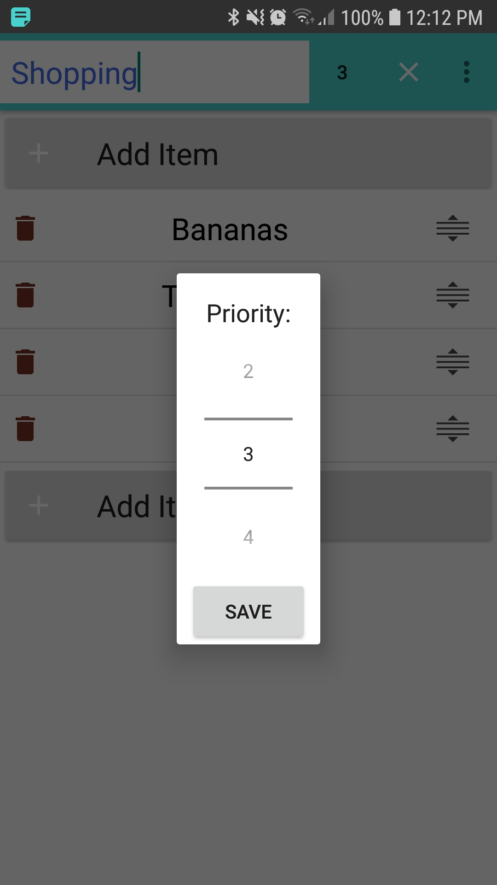

# Feature-Notes
Wouldn't it be great to detect and copy text from within our photos?  
How about adding note items while OTHER apps are in the foreground?

These are some useful features you'll find in this app and I can't wait to add more!

 This project is written in Kotlin and showcases these concepts:

- Architecture Components: MVVM, Room, Live Data, Observing DB changes.
- Dependency Injection with Koin (Repository, NotificationManager and ViewModel).
- Using Kotlin Coroutines for necessary asynchronous DB operations.
- Transitioning between Fragments with Navigation Drawer layout.
- Parcelable Note data class, so we can pass it between Activities.
- TypeConverter for storing non-primitive object types in Room Database.
- ItemTouchHelper callbacks for gesture detection: drag & drop items.
- Custom Views (AlertDialog) managing their own UI setup and lifecycle.
- Note priority influences the order of notes displayed within list.
- Generating primary key, where insert() provides us a unique ID val.
- Auto-scroll to bottom of list when adding note items to the end.
- Setting notes as Notifications, for quick add, even while watching a video.
- Restore deleted/archived notes and items, through quick SnackBar action.
- Revert changes is possible during note editing session.
- Share notes easily + quick text copy of individual note items.
- Settings Activity - simple example using Jetpack Preferences
- Click to ~~Strike Through note items~~ and mark them as DONE.
- Espresso Instrumentation tests across multiple activities.
- Text Recognition - extracting words and numbers from your photos.

 

 

I know there are some basic features I haven’t included, I can't do everything on my own...  
Feel free to support ⭐ and join the coding! I can't wait to hear your thoughts and suggestions 👍

 

