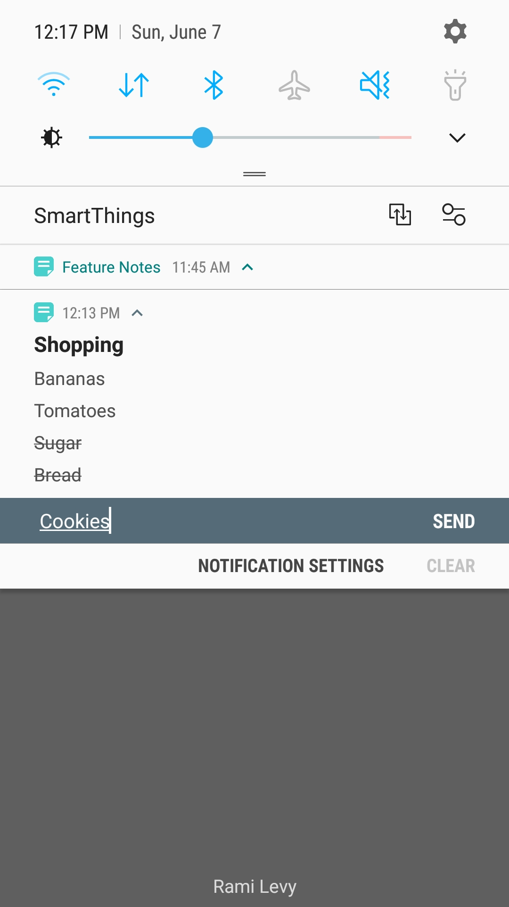

# Feature-Notes
I was motivated to add features I haven’t seen in other note apps, such as adding notes through notification actions, 
where the user can add items while other apps are in foreground (playing a video for example).

 This sample project contains and showcases these concepts:

- Kotlin language + Kotlin extension function (View visibility). 
- Architecture Components: MVVM, Room, Live Data, Observing DB changes.
- Dependency Injection for our Repository (small and hand made).
- Using Kotlin Coroutines for necessary asynchronous DB operations.
- Parcelable Note data class, so we can pass it between Activities.
- TypeConverter for converting List of objects to a String and back.
- Database ViewModel - mutual data access through all activities.
- ItemTouchHelper callbacks for gesture detection: drag & drop items.
- Custom Views (AlertDialog) managing their own UI setup and lifecycle.
- Toolbar layouts containing menu items in conjunction with custom menu layouts.
- Data persistence, so we don’t lose data, even when app task is removed.
- auto generated primary key, where insert() provides us a unique ID val.
- Setting notes as Notifications, for quick add, even while watching a video.
- UNDO after deletion, SnackBar for quick restore of notes and note items.
- Espresso Instrumentation tests across both activities.

 

 

I know there are many basic features I haven’t included yet, my focus was getting familiar with Kotlin.
figured I'll open-source, to hear tips on how to improve code structure and modularity, so be my guest :)
I do plan on adding interesting features, so please let me know what similar apps are missing.

 

