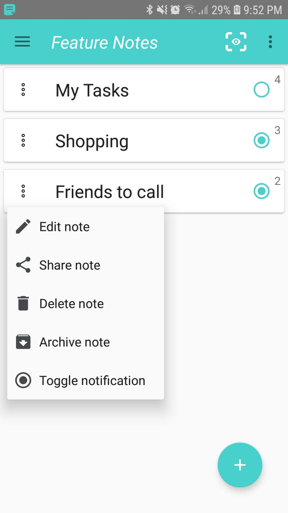

# Feature-Notes
I was motivated to add features I haven’t seen in other note apps, such as adding notes through notification actions, 
where the user can add items while other apps are in foreground (playing a video for example).

 This sample project contains and showcases these concepts:

- Kotlin language + Kotlin extension functions.
- Architecture Components: MVVM, Room, Live Data, Observing DB changes.
- Dependency Injection with Koin: injecting Repository, NotificationManager and ViewModel.
- Using Kotlin Coroutines for necessary asynchronous DB operations.
- Parcelable Note data class, so we can pass it between Activities.
- TypeConverter for storing non-primitive object types in Room Database.
- Database ViewModel - a single data entry point for all activities.
- ItemTouchHelper callbacks for gesture detection: drag & drop items.
- Custom Views (AlertDialog) managing their own UI setup and lifecycle.
- Setting a priority for each note, influences the order in the main list.
- Toolbar layouts containing menu items in conjunction with custom menu layouts.
- Data persistence, so we don’t lose data, even when app task is removed.
- auto generated primary key, where insert() provides us a unique ID val.
- Nested ScrollView with auto scroll when adding bottom note items.
- Text Recognition - extract words and numbers from your photos (Firebase Machine Learning API).
- Setting notes as Notifications, for quick add, even while watching a video.
- RESTORE deleted notes and items, through SnackBar action.
- REVERT CHANGES menu item, during note editing session.
- Share notes easily + quick text copy of individual note items.
- click to ~~Strike Through note items~~ and mark them as DONE.
- Espresso Instrumentation tests across multiple activities.

 

 

I know there are many basic features I haven’t included yet, my focus was getting familiar with Kotlin.
figured I'll open-source, to hear tips on how to improve code structure and modularity, so be my guest :)
I do plan on adding interesting features, so please let me know what similar apps are missing.

 

